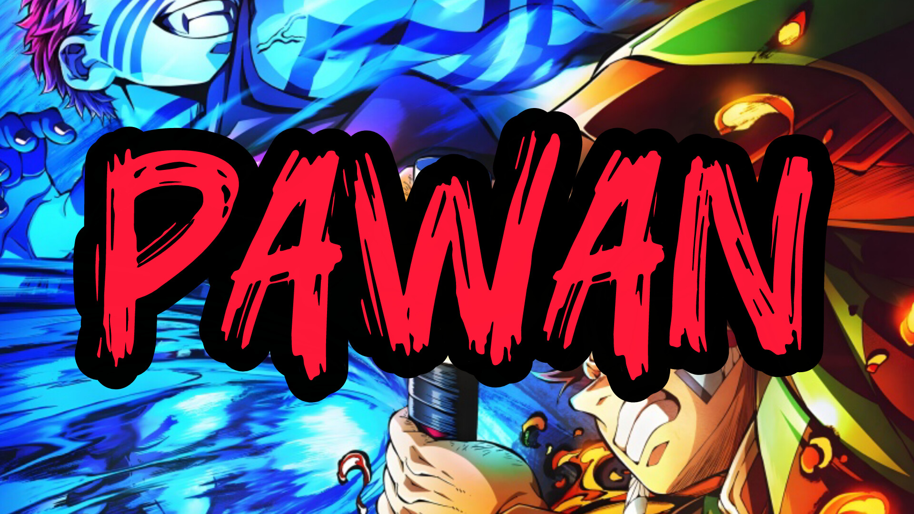

<!-- 🌟 Professional GitHub Portfolio for PAWANxDEV-VIP -->

<h1 align="center">👋 Hey, I'm DEV - PAWAN</h1>

  

  <b>💻 Developer | 🎮 Gamer | ☁️ Discord Bot & Server Developer | 🧱 Minecraft Server Dev</b>

---

## 🧠 Languages & Technologies

  

---

## ⚙️ My Skills

<table align="center">
<tr>
<td align="center"> <b>Discord Bot Dev</b></td>
<td align="center"> <b>Discord Server Dev</b></td>
<td align="center"> <b>Minecraft Server Dev</b></td>
<td align="center"> <b>YouTuber</b></td>
<td align="center"> <b>Gamer</b></td>
</tr>
</table>

---

## 🪪 About Me

| 🧩 Info | 💬 Details |
|----------|-------------|
| 👤 **Name** | PAWAN |
| 🎂 **Age** | 17 Years |
| 🧠 **Username** | [PAWANxDEV-VIP](https://github.com/PAWANxDEV-VIP) |
| 🌍 **From** | India |
| ⚡ **Passion** | Building bots, automations & cool community tools |

---

## 🚀 Projects & Achievements

> 🅠**Total Stars:**   
> 💻 **Total Projects:**   
> 🧠 **Achievements:** “Creating tools that help developers and gamers connect.”

---

## 📊 GitHub Analytics

  
  

  

---

## 🌐 Connect With Me

  
  
  

---

<h3 align="center">⭐ “Code, Create, and Inspire.” ⭐</h3>

  

